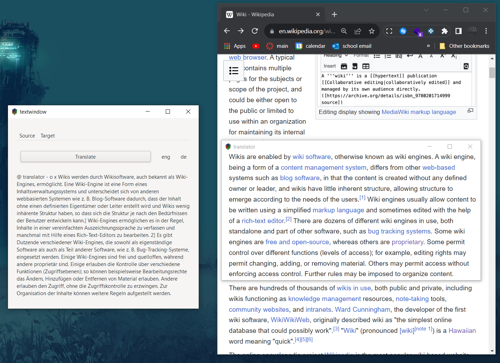

# Progress Updates

## Update 1 - 9th September 2023

### Application example

This is kind of the absolute basic use case I imagined, of just being able to capture any text on the screen and being able to translate it. The main benifits of this approach being that 

- You can translate text of any type, that is, on a website, in an image, in a video, places which googles website translation can't get to, fails on or isn't implemented for.

- There is no downloading or uploading images anywhere and you don't need to pull out your phone, you just select exactly what you want to translate.

With the core idea here being that you can translate anything anywhere on your desktop with the click of a button.

### Whats next ? 

The primary thing I will be focusing on is improving the basic screenshot translation and getting it to a polished state where it creates a full basic feature. This will include making sure the `translator` window is completely invisible when it captures an image in addition to polishing some of the basic UI so it becomes a bit more intuitive to use. Aswell as adding some basic preprocessing for both the image and the OCR'd text.