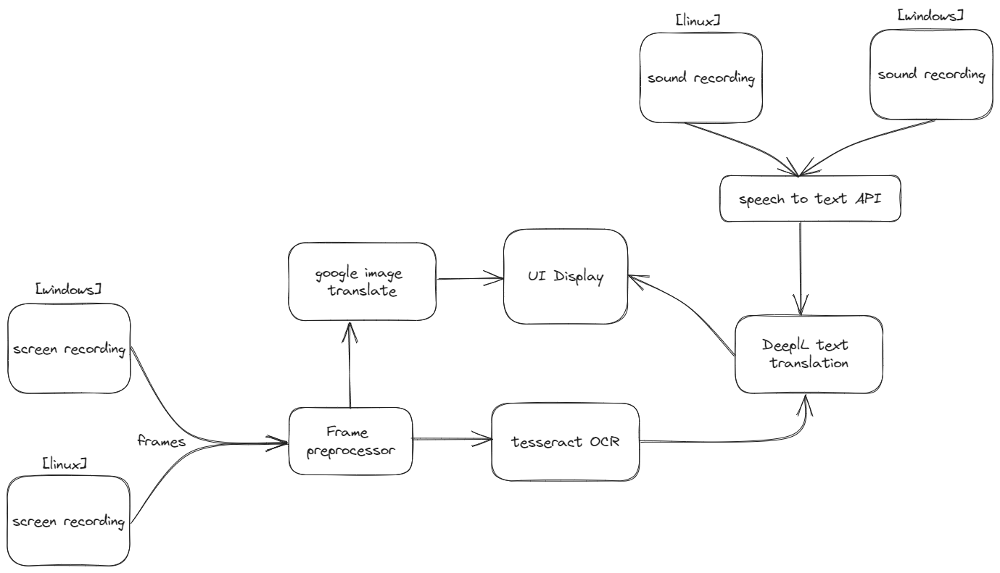

# live-ocr-translator


## Why

> **DISCLAIMER** This project is still in very early development and **does not work** you can refer to the Features section in here to see the things currently implemented / will be implemented. I am committed to getting this in a functional state soon enough hopefully, but right now you can unfortunately not use this. Do feel free to contribute by opening a PR though. As I am a student things migth still take a while so I am accepting all the help I can get.


This is basically just a desktop implementation of googles version of live translation. To my knowledge the three main options for translating on screen content are

- Screenshot
- Google Translate app live translate
- Copy pasting text

This project aims to add a 4th option where you can specify a region of text on the screen to translate and then either translate just any text recognized in this specified segment or translate the text in real time as it changes.

### Future Applications

- Live translation of subtitles when preferred option does not exist
- Live translation of text content in games without a translation
- General translation of any text visible

## Features

- [ ] Basic image translation for common languages
  - [ ] Windows
  - [ ] Linux
- [ ] Live text translation
  - [ ] Windows
  - [ ] Linux
- [ ] GUI refinements
- [ ] Accurate translation through image preprocessing
- [ ] Live audio translation
  - [ ] Windows
  - [ ] Linux
- [ ] Final GUI improvements

## Contributing

### Windows

Currently I am developing primarily for windows so to test the application on windows first build the dockerfile then each time you want to compile the application for windows run the `cross_compile.sh` script.

To build image with the required dependencies

```bash
docker build . -t gtkrs-crosscomp
```

Once you have the cross compilation image built you can just runn the cross compile script whenever you want to build the application for windows. The zip should then appear in the root directory of the project.

```bash
./cross_compile.sh
```

The packaged application should then appear in your root directory in the folder gtkapp

### Help

This is a somewhat larger undertaking than what I usually do, so I would greatly appreciate any contributions to any aspect of the app.

### Visual feature outline


